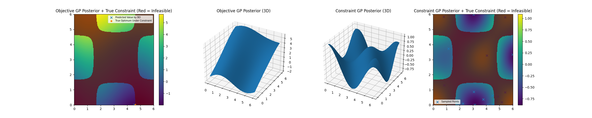

# Bayesian Optimization Algorithm with Constraints

This repository implements a Bayesian Optimization (BO) algorithm with Gaussian Process (GP) regressors for modeling both objective and constraint functions. It is designed to efficiently find the optimal solution within a constrained domain.

## Features

- **Bayesian Optimization**: Uses Gaussian Process regression to model objective and constraint functions.
- **Acquisition Function**: Computes expected improvement (EI) adjusted for constraints.
- **Optimization**: Includes multi-start local optimization for acquisition function maximization.
- **Extended Evaluation**: Visualizes GP posterior for both objective and constraint models.

## Results

### Visualization Outputs

- **Objective GP Posterior with True Constraints**

  
## Prerequisites

Install the required dependencies:

```bash
pip install numpy scipy scikit-learn matplotlib
```

## Usage

1. Ensure the domain and constraints are defined in the `domain_x` and `c()` functions, respectively.
2. Run the main script:

```bash
python solution.py
```

3. If `EXTENDED_EVALUATION` is set to `True`, the script will generate visualizations in the output directory.

## File Structure

- `solution.py`: Main implementation of the Bayesian Optimization algorithm.
- `extended_evaluation.pdf`: Generated visualization report showing GP posterior predictions.

## Author

This repository is designed for optimizing constrained problems using Bayesian Optimization and Gaussian Process regressors.

